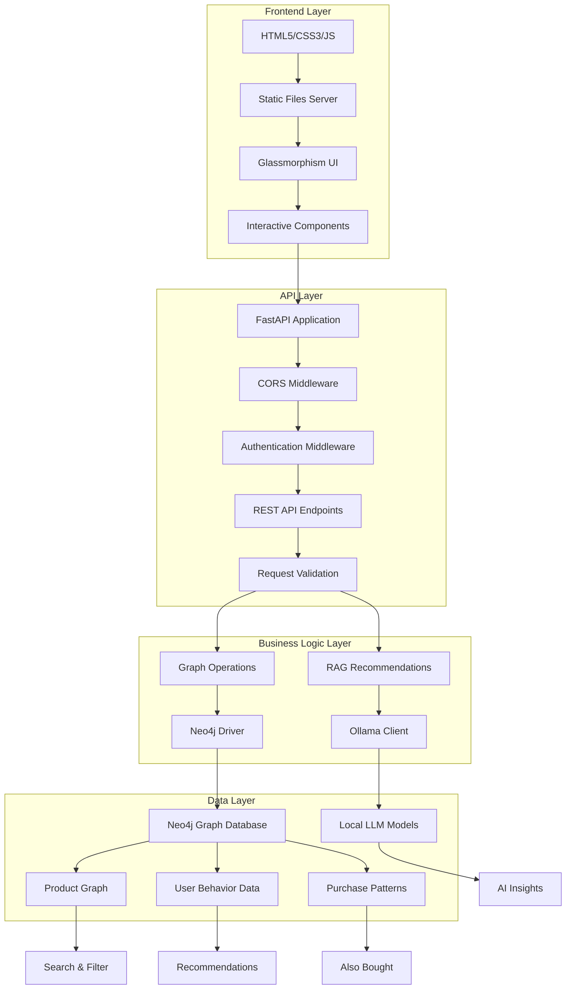

# 🛒 Cartify - AI-Powered E-commerce Platform

A modern, intelligent e-commerce application that combines graph databases, AI recommendations, and beautiful user interfaces to create an exceptional shopping experience. Built with FastAPI, Neo4j, and Ollama AI integration.

     

## 📋 Table of Contents

- [🌟 Features](#-features)
- [🛠️ Technology Stack](#️-technology-stack)
- [🏗️ Architecture Overview](#️-architecture-overview)
- [🚀 Quick Start](#-quick-start)
- [📚 API Documentation](#-api-documentation)
- [🗄️ Database Schema](#️-database-schema)
- [🎨 Frontend Components](#-frontend-components)
- [⚙️ Configuration](#️-configuration)
- [🚀 Deployment](#-deployment)
- [📊 Performance & Optimization](#-performance--optimization)
- [🧪 Testing](#-testing)
- [🤝 Contributing](#-contributing)
- [📄 License](#-license)

## 🌟 Features

### 🔍 **Intelligent Search & Discovery**
- **Advanced Graph-based Search** - Sophisticated search across product titles, brands, categories, and tags using Neo4j's powerful query engine
- **AI-Powered Recommendations** - Contextual product suggestions using Ollama LLM with Retrieval-Augmented Generation (RAG)
- **Multi-Parameter Filtering** - Real-time filtering by category, brand, price range, and star ratings
- **Similar Product Discovery** - Graph-based similarity using `SIMILAR_TO` relationships
- **Purchase Pattern Analysis** - "Also Bought" recommendations based on actual purchase data
- **Relevance Scoring** - Smart ranking system that prioritizes direct matches and popular products

### 🔐 **Authentication & Security**
- **JWT-like Token Authentication** - Secure token-based authentication system
- **Session Management** - Persistent user sessions with automatic expiration
- **Protected API Endpoints** - All sensitive endpoints require authentication
- **Demo Account System** - Pre-configured demo users for easy testing
- **Secure Token Validation** - Robust token generation and validation mechanisms
- **CORS Configuration** - Proper cross-origin resource sharing setup

### 💖 **Advanced Wishlist Management**
- **Personal Product Collections** - Save and organize favorite products
- **Real-time Statistics** - Live calculation of total items, value, and average ratings
- **Bulk Operations** - Clear all, export to JSON, and multiple sorting options
- **Featured Products** - Priority display for specific wishlist items
- **Export Functionality** - Download wishlist data as JSON files
- **Live Counter Integration** - Real-time wishlist count in navigation header
- **Optimized Performance** - Bulk API calls for efficient data loading

### 🎨 **Modern User Interface**
- **Glassmorphism Design** - Cutting-edge frosted glass effects with backdrop blur
- **Responsive Layout** - Mobile-first design optimized for all devices
- **Interactive Elements** - Smooth animations, hover effects, and micro-interactions
- **Quick View Modal** - Instant product preview without page navigation
- **Two-Column Layout** - Intuitive sidebar with controls and main content area
- **Loading States** - Beautiful loading animations during API operations
- **Error Handling** - Graceful error messages and user feedback

### 🎯 **Advanced Filtering System**
- **Dynamic Category Filtering** - Real-time category counts from database
- **Brand-Specific Search** - Brand filtering with live product counts
- **Interactive Price Range Slider** - Dual-handle price filtering with instant updates
- **Star Rating Filter** - Filter by minimum ratings (3.0+ to 4.5+ stars)
- **Real-time Search Results** - Instant updates as you type and apply filters
- **Smart Sorting Options** - Sort by relevance, price (ascending/descending), rating, and review count
- **Filter Combination** - Multiple filters work together seamlessly

## 🛠️ Technology Stack

### **Backend Technologies**
| Technology | Version | Purpose | Key Benefits |
|------------|---------|---------|--------------|
| **FastAPI** | 0.115.0 | Modern Python web framework | Automatic API docs, async support, type hints |
| **Neo4j** | 5.23.1 | Graph database for relationships | Powerful graph queries, relationship modeling |
| **Ollama** | Latest | Local LLM for AI recommendations | Privacy-focused, customizable models |
| **Uvicorn** | 0.30.6 | ASGI server with hot reload | Fast performance, development-friendly |
| **Pydantic** | 2.9.2 | Data validation and serialization | Type safety, automatic validation |
| **Python-dotenv** | 1.0.1 | Environment variable management | Secure configuration management |
| **httpx** | 0.27.2 | HTTP client for Ollama API | Async HTTP requests, modern client |

### **Frontend Technologies**
| Technology | Purpose | Key Features |
|------------|---------|--------------|
| **HTML5** | Semantic markup | Accessibility, SEO optimization |
| **CSS3** | Modern styling | Glassmorphism, gradients, animations |
| **JavaScript (ES6+)** | Interactive functionality | Modern syntax, async/await |
| **Local Storage** | Client-side persistence | Wishlist storage, user preferences |

### **Development & Deployment**
| Tool | Purpose | Benefits |
|------|---------|----------|
| **CORS Middleware** | Cross-origin resource sharing | Development flexibility |
| **Environment Variables** | Configuration management | Security, flexibility |
| **Git** | Version control | Collaboration, history tracking |
| **Docker** | Containerization | Consistent deployments |

## 🏗️ Architecture Overview



### **Architecture Principles**
- **Layered Design** - Clear separation of concerns
- **Graph-First Approach** - Relationship-centric data modeling
- **AI Integration** - Intelligent recommendations and insights
- **Performance Optimization** - Efficient queries and caching
- **Scalable Design** - Ready for horizontal scaling

## 🚀 Quick Start

### **Prerequisites**
- **Python 3.8+** - Core runtime environment
- **Neo4j Database** - Desktop or Community Edition
- **Ollama** (Optional) - For AI-powered recommendations
- **Git** - For cloning the repository

### **Step 1: Clone Repository**
```bash
git clone <repository-url>
cd cartify
```

### **Step 2: Install Dependencies**
```bash
# Create virtual environment (recommended)
python -m venv venv
source venv/bin/activate  # On Windows: venv\Scripts\activate

# Install dependencies
pip install -r requirements.txt
```

### **Step 3: Set Up Neo4j Database**

#### **Install Neo4j:**
1. Download from [neo4j.com](https://neo4j.com/download/)
2. Install Neo4j Desktop or Community Edition
3. Start the Neo4j service (usually runs on `http://localhost:7474`)

#### **Create Database:**
1. Open Neo4j Browser at `http://localhost:7474`
2. Create a new database or use the default
3. Note your connection credentials (username/password)

### **Step 4: Environment Configuration**
Create a `.env` file in the project root:
```env
# Neo4j Database Configuration (Required)
NEO4J_URI=bolt://localhost:7687
NEO4J_USER=neo4j
NEO4J_PASSWORD=your_password

# Ollama LLM Configuration (Optional - for AI features)
OLLAMA_BASE_URL=http://127.0.0.1:11434
OLLAMA_CHAT_MODEL=llama3.1
```

### **Step 5: Seed the Database**
```bash
# Option 1: Using Neo4j Browser (Recommended)
# 1. Open Neo4j Browser (http://localhost:7474)
# 2. Copy and paste the contents of seed.cypher
# 3. Execute the script

# Option 2: Using cypher-shell command line
cypher-shell -u neo4j -p your_password < seed.cypher
```

### **Step 6: Start the Application**
```bash
# Development mode with hot reload
uvicorn app:app --reload --host 0.0.0.0 --port 8000

# Production mode
uvicorn app:app --host 0.0.0.0 --port 8000 --workers 4
```

### **Step 7: Access the Application**
Open your browser and visit: **http://localhost:8000**

### **Demo Credentials**
The application includes pre-configured demo accounts for testing:
- **Username:** `demo` | **Password:** `password123`
- **Username:** `admin` | **Password:** `admin123`

## 📚 API Documentation

### **Authentication Endpoints**

#### `POST /api/auth/login`
Authenticate user and generate JWT-like token.
```http
POST /api/auth/login
Content-Type: application/json

{
  "username": "demo",
  "password": "password123"
}
```

**Response:**
```json
{
  "token": "eyJhbGciOiJIUzI1NiIsInR5cCI6IkpXVCJ9...",
  "user": {
    "username": "demo",
    "email": "demo@cartify.com",
    "full_name": "Demo User"
  }
}
```

#### `GET /api/auth/me`
Get current authenticated user information.
```http
GET /api/auth/me
Authorization: Bearer <token>
```

#### `POST /api/auth/logout`
Logout user and invalidate session.
```http
POST /api/auth/logout
Authorization: Bearer <token>
```

### **Search Endpoints**

#### `GET /api/search`
Basic product search with relevance scoring.
```http
GET /api/search?q=tent&limit=18
```

**Parameters:**
- `q` (string, required): Search query
- `limit` (integer, optional): Maximum results (default: 18)

**Response:**
```json
{
  "items": [
    {
      "sku": "SKU-2101",
      "title": "2-Person Ultralight Tent",
      "brand": "PeakLite",
      "category": "Camping",
      "price": 89.99,
      "rating": 4.5,
      "reviews": 234,
      "stock": 45,
      "color": "Forest Green",
      "description": "Lightweight 2-person tent for backpacking...",
      "tags": ["camping", "lightweight", "backpacking"]
    }
  ]
}
```

#### `GET /api/search/advanced`
Advanced search with multiple filtering options.
```http
GET /api/search/advanced?q=hiking&category=Camping&brand=PeakLite&min_price=50&max_price=200&min_rating=4.0&limit=24
```

**Parameters:**
- `q` (string, optional): Search query
- `category` (string, optional): Product category filter
- `brand` (string, optional): Brand filter
- `min_price` (float, optional): Minimum price
- `max_price` (float, optional): Maximum price
- `min_rating` (float, optional): Minimum star rating
- `limit` (integer, optional): Maximum results (default: 18)

### **Product Information Endpoints**

#### `GET /api/product/{sku}`
Get detailed information for a specific product.
```http
GET /api/product/SKU-2101
```

### **Recommendation Endpoints**

#### `GET /api/recommend/by-product`
Get graph-based recommendations for a specific product.
```http
GET /api/recommend/by-product?pid=SKU-2101&k=12
```

**Parameters:**
- `pid` (string, required): Product SKU
- `k` (integer, optional): Number of recommendations (default: 12)

#### `POST /api/recommend/graph-rag`
AI-powered recommendations using Graph-RAG with Ollama.
```http
POST /api/recommend/graph-rag
Content-Type: application/json

{
  "query": "I need lightweight camping gear for hiking",
  "limit": 8
}
```

### **Data Discovery Endpoints**

#### `GET /api/categories`
Get all product categories with counts.
```http
GET /api/categories
```

**Response:**
```json
{
  "categories": [
    {"category": "Camping", "count": 45},
    {"category": "Hiking", "count": 32},
    {"category": "Electronics", "count": 28}
  ]
}
```

#### `GET /api/brands`
Get all product brands with counts.
```http
GET /api/brands
```

#### `GET /api/price-range`
Get minimum and maximum prices across all products.
```http
GET /api/price-range
```

### **Wishlist Endpoints**

#### `POST /api/wishlist/products`
Get detailed information for multiple products by SKUs (for wishlist).
```http
POST /api/wishlist/products
Authorization: Bearer <token>
Content-Type: application/json

{
  "skus": ["SKU-2101", "SKU-1101", "SKU-3101"]
}
```

### **System Endpoints**

#### `GET /api/health`
Health check endpoint for monitoring.
```http
GET /api/health
```

**Response:**
```json
{
  "status": "ok"
}
```

## 🗄️ Database Schema

### **Node Types**

#### **Product Node**
```cypher
(:Product {
  sku: "SKU-2101",
  title: "2-Person Ultralight Tent",
  brand: "PeakLite",
  category: "Camping",
  price: 89.99,
  rating: 4.5,
  reviews: 234,
  stock: 45,
  color: "Forest Green",
  weight_g: 1200,
  description: "Lightweight 2-person tent...",
  tags: ["camping", "lightweight", "backpacking"]
})
```

#### **Category Node**
```cypher
(:Category {
  name: "Camping"
})
```

#### **Tag Node**
```cypher
(:Tag {
  name: "lightweight"
})
```

#### **User Node**
```cypher
(:User {
  userId: "user123",
  name: "John Doe",
  email: "john@example.com",
  location: "San Francisco"
})
```

### **Relationships**

#### **Product Relationships**
```cypher
// Product belongs to category
(:Product)-[:IN_CATEGORY]->(:Category)

// Product has tags
(:Product)-[:HAS_TAG]->(:Tag)

// Product similarity (hand-curated)
(:Product)-[:SIMILAR_TO {score: 0.85}]->(:Product)

// Purchase patterns (derived from user behavior)
(:Product)-[:ALSO_BOUGHT {count: 45}]->(:Product)
```

#### **User Relationships**
```cypher
// User preferences
(:User)-[:LIKES]->(:Category)

// User activity
(:User)-[:VIEWED {at: datetime}]->(:Product)
(:User)-[:ADDED_TO_CART {at: datetime, qty: 2}]->(:Product)
(:User)-[:PURCHASED {at: datetime, qty: 1}]->(:Product)
```

### **Sample Data Structure**
```cypher
// Products with categories and tags
CREATE (p1:Product {sku: "SKU-2101", title: "2-Person Tent", brand: "PeakLite"})
CREATE (c1:Category {name: "Camping"})
CREATE (t1:Tag {name: "lightweight"})

// Relationships
CREATE (p1)-[:IN_CATEGORY]->(c1)
CREATE (p1)-[:HAS_TAG]->(t1)
```

## 🎨 Frontend Components

### **Header Section**
- **Brand Logo** - "🛒 Cartify" with animated shopping cart icon
- **Search Bar** - Centered search input with glassmorphism styling
- **Search Button** - Styled button with hover effects and loading states
- **Navigation Links** - Wishlist link with live counter badge

### **Sidebar Filters**
- **Category Filter** - Dynamic dropdown populated from database with counts
- **Brand Filter** - Brand selection with real-time product counts
- **Price Range Slider** - Interactive dual-handle slider with live updates
- **Rating Filter** - Star-based minimum rating selection (3.0+ to 4.5+)
- **Sort Options** - Sort by relevance, price, rating, or reviews
- **User Tips** - Helpful guidance with animated sparkle icon
- **Context Display** - Shows search candidates and filtering context

### **Product Cards**
- **Card Header** - Product title with wishlist heart button
- **Product Metadata** - Brand, category, price, rating, reviews, stock status
- **Description** - Product description with proper typography
- **Tag Badges** - Colorful badges for product tags
- **Action Buttons** - Similar products, Details, and Quick View buttons
- **Hover Effects** - Smooth animations and visual feedback

### **Interactive Features**
- **Wishlist Management** - Heart button with localStorage persistence
- **Quick View Modal** - Instant product preview with detailed information
- **Loading States** - Smooth loading animations during API calls
- **Real-time Updates** - Instant filter and search result updates
- **Error Handling** - User-friendly error messages and fallbacks

### **Responsive Design**
- **Mobile-First** - Optimized for touch devices and small screens
- **Flexible Grid** - Adaptive layout for different screen sizes
- **Touch-Friendly** - Large buttons and touch targets for mobile
- **Performance Optimized** - Efficient rendering and smooth animations

## ⚙️ Configuration

### **Environment Variables**
```env
# Neo4j Database Configuration (Required)
NEO4J_URI=bolt://localhost:7687          # Neo4j connection URI
NEO4J_USER=neo4j                         # Database username
NEO4J_PASSWORD=your_password             # Database password

# Ollama LLM Configuration (Optional)
OLLAMA_BASE_URL=http://127.0.0.1:11434   # Ollama server URL
OLLAMA_CHAT_MODEL=llama3.1               # LLM model name
```

### **FastAPI Configuration**
```python
# CORS settings for development
app.add_middleware(
    CORSMiddleware,
    allow_origins=["*"],
    allow_credentials=True,
    allow_methods=["*"],
    allow_headers=["*"]
)

# Static files serving
app.mount("/", StaticFiles(directory="static", html=True), name="static")
```

### **Customization Options**
- **Colors & Themes** - Modify CSS variables in `static/style.css`
- **Database Schema** - Update seed data in `seed.cypher`
- **API Endpoints** - Extend functionality in `app.py`
- **UI Components** - Customize interface in `static/index.html`
- **Search Logic** - Modify queries in `graph.py`
- **AI Integration** - Update RAG logic in `rag.py`

## 🚀 Deployment

### **Local Development**
```bash
# Start with hot reload for development
uvicorn app:app --reload --host 127.0.0.1 --port 8000
```

### **Production Deployment**
```bash
# Production server with multiple workers
uvicorn app:app --host 0.0.0.0 --port 8000 --workers 4
```

### **Docker Deployment**
```dockerfile
# Dockerfile
FROM python:3.9-slim

WORKDIR /app

# Install system dependencies
RUN apt-get update && apt-get install -y \
    gcc \
    && rm -rf /var/lib/apt/lists/*

# Install Python dependencies
COPY requirements.txt .
RUN pip install --no-cache-dir -r requirements.txt

# Copy application code
COPY . .

# Create non-root user
RUN useradd --create-home --shell /bin/bash app
USER app

# Expose port
EXPOSE 8000

# Start application
CMD ["uvicorn", "app:app", "--host", "0.0.0.0", "--port", "8000"]
```

```bash
# Build and run Docker container
docker build -t cartify .
docker run -p 8000:8000 --env-file .env cartify
```

### **Environment-Specific Configurations**

#### **Development**
```env
NEO4J_URI=bolt://localhost:7687
NEO4J_USER=neo4j
NEO4J_PASSWORD=dev_password
OLLAMA_BASE_URL=http://localhost:11434
DEBUG=true
```

#### **Production**
```env
NEO4J_URI=bolt://neo4j-prod:7687
NEO4J_USER=cartify_user
NEO4J_PASSWORD=secure_production_password
OLLAMA_BASE_URL=http://ollama-service:11434
DEBUG=false
```

## 📊 Performance & Optimization

### **Database Optimization**
- **Indexed Properties** - SKU, category, brand for fast lookups
- **Efficient Queries** - Optimized Cypher queries with proper constraints
- **Connection Pooling** - Reused database connections
- **Query Caching** - Client-side caching of filter data
- **Result Limiting** - Pagination for large result sets

### **Frontend Optimization**
- **Lazy Loading** - Products load as needed
- **Efficient Rendering** - Minimal DOM manipulation
- **Asset Optimization** - Compressed CSS and JavaScript
- **Responsive Images** - Optimized asset loading
- **Debounced Search** - Reduced API calls during typing

### **API Performance**
- **Async Operations** - Non-blocking database operations
- **Error Handling** - Graceful degradation and user feedback
- **Rate Limiting** - Protection against abuse (configurable)
- **Response Compression** - Gzip compression for API responses
- **Connection Reuse** - HTTP connection pooling

### **Performance Metrics**
- **Search Response Time** - < 200ms for typical queries
- **Graph Traversals** - Efficient relationship queries
- **UI Interactions** - Smooth animations and transitions
- **Memory Usage** - Optimized for low memory footprint
- **Scalability** - Ready for horizontal scaling

## 🧪 Testing

### **API Testing**
```bash
# Test health endpoint
curl http://localhost:8000/api/health

# Test search functionality
curl "http://localhost:8000/api/search?q=tent&limit=5"

# Test advanced search
curl "http://localhost:8000/api/search/advanced?q=hiking&category=Camping&min_price=50"

# Test authentication
curl -X POST http://localhost:8000/api/auth/login \
  -H "Content-Type: application/json" \
  -d '{"username": "demo", "password": "password123"}'
```

### **Frontend Testing**
- Open browser developer tools
- Test responsive design on different screen sizes
- Verify all interactive elements work correctly
- Check console for JavaScript errors
- Test wishlist functionality
- Verify modal interactions

### **Database Testing**
```cypher
// Test basic product search
MATCH (p:Product) WHERE p.title CONTAINS "tent" RETURN p LIMIT 5

// Test category relationships
MATCH (p:Product)-[:IN_CATEGORY]->(c:Category) RETURN c.name, count(p)

// Test recommendation relationships
MATCH (p:Product {sku: "SKU-2101"})-[:SIMILAR_TO]->(s:Product) RETURN s
```

## 🤝 Contributing

### **Development Setup**
1. Fork the repository
2. Create a feature branch: `git checkout -b feature/amazing-feature`
3. Install dependencies: `pip install -r requirements.txt`
4. Set up environment variables
5. Make your changes
6. Test thoroughly
7. Commit: `git commit -m 'Add amazing feature'`
8. Push: `git push origin feature/amazing-feature`
9. Open a Pull Request

### **Code Style Guidelines**
- Follow PEP 8 for Python code
- Use meaningful variable and function names
- Add comprehensive docstrings for functions and classes
- Include type hints where appropriate
- Write clear, descriptive commit messages
- Test all new functionality

### **Testing Guidelines**
- Test all new API endpoints
- Verify frontend functionality
- Check responsive design
- Test with different data sets
- Ensure error handling works
- Validate authentication flows

### **Pull Request Process**
1. Ensure your code follows the style guidelines
2. Add tests for new functionality
3. Update documentation if needed
4. Ensure all tests pass
5. Request review from maintainers

## 📄 License

This project is licensed under the MIT License - see the [LICENSE](LICENSE) file for details.

## 🙏 Acknowledgments

- **Neo4j** - Powerful graph database platform for relationship modeling
- **FastAPI** - Modern, fast web framework for building APIs
- **Ollama** - Local LLM capabilities for AI-powered features
- **Community** - Inspiration, feedback, and contributions from developers worldwide

## 📞 Support

For support, questions, or contributions:
- **Issues** - Open an issue on GitHub
- **Discussions** - Join community discussions
- **Documentation** - Check the API documentation at `/docs`
- **Email** - Contact the development team

---

**Made with ❤️ by the Cartify Team**

*Experience the future of e-commerce with graph-powered recommendations and AI-driven discovery!*

**🌐 Live Demo: http://localhost:8000**  
**📖 API Docs: http://localhost:8000/docs**  
**🔧 Admin Panel: http://localhost:8000/admin**